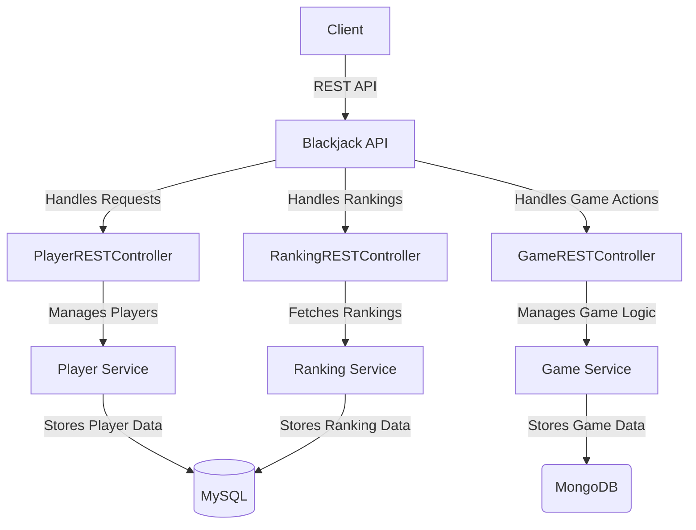

# 🃏 Blackjack API

## 🎯 Overview
Welcome to the **Blackjack API**, a modern **WebFlux-based** REST API designed for building and simulating the classic game of **Blackjack**. This API provides reactive gameplay mechanics, real-time score tracking, and seamless database integration using **MongoDB** and **MySQL**.

## 🚀 Key Features
✅ **Reactive WebFlux Architecture** – Built with **Spring WebFlux** for high-performance, non-blocking gameplay.  
✅ **Multi-Database Support** – Uses **MongoDB (Reactive)** and **MySQL (R2DBC)** for flexible data storage.  
✅ **Game Management** – Create, play, and delete Blackjack games with real-time updates.  
✅ **Player System** – Register, modify, and track player stats.  
✅ **RESTful API Design** – Fully documented with **OpenAPI (Swagger)** for easy integration.  
✅ **Hexagonal Architecture** – Well-structured domain-driven design for maintainability.  

---

## 📖 Documentation
### 📖 Architecture Overview


## To run a project:

Move to the base folder of the project you want to run and:


- Compile the project
```bash
mvn compile
```
- Pack the project
```bash
mvn package
```
- Clean the project
```bash
mvn clean
```
- Execute the application
```bash
mvn spring-boot:run
```
### For API endpoints and usage, refer to the **Swagger UI**:
```sh
http://localhost:8080/swagger-ui.html
```
### Technologies:
- Java 23
- Maven 3.6.3
- Spring boot 3.4.1
- MySQL 9.1.0
- MongoDB 8.0.3

### Dependencies:
- Spring Webflux
- Spring R2DBC
- Lombok
- Swagger
- Spring Reactive MongoDB
- Mockito
- JUnit
- ArchUnit

##
